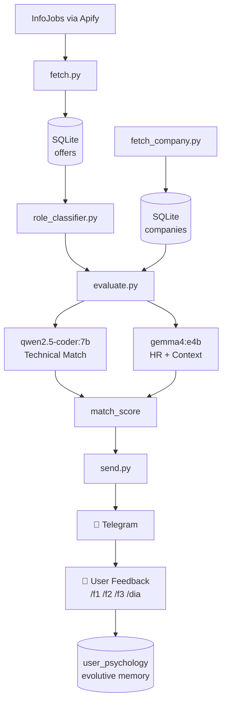

# Job Intelligence Agent


> Personal career intelligence system. Extracts job offers from InfoJobs, evaluates CV match using local LLMs (Ollama), and delivers daily recommendations via Telegram.

Built for the Spanish job market. Fully offline-first — no data leaves your machine except the Telegram notification.

---

## How It Works

The system runs a daily pipeline: it scrapes fresh job offers from InfoJobs via Apify, classifies each offer by actual role (based on requirements, not job title), scores them against your CV using two specialized local models, and sends the top matches to your Telegram. Over time, it learns from your feedback and builds a psychological profile of your preferences.



Two models, one pipeline:

| Model | Role | Temperature | Output |
|---|---|---|---|
| `qwen2.5-coder:7b` | Technical evaluator | `0.1` | Structured JSON scores |
| `gemma4:e4b` | HR reasoning + strategy | `0.4` | Contextual analysis + advice |

---

## Tech Stack

| Layer | Technology |
|---|---|
| Language | Python 3.14+ |
| Database | SQLite (WAL mode) |
| ORM | SQLAlchemy 2.0 |
| Local LLMs | Ollama (`qwen2.5-coder:7b`, `gemma4:e4b`) |
| Job data source | Apify — InfoJobs Spain Jobs Scraper |
| Notifications | Telegram Bot API |
| Linting | Ruff |
| Scheduling | cron |

---

## Project Structure

```
job-intelligence-agent/
├── AGENTS.md               ← AI agent context (read by OpenCode)
├── PERFIL.md               ← Candidate source of truth (gitignored)
├── PLANS.md                ← Project ledger (phases + task status)
├── MEMORIES.md             ← Accumulated system learnings
├── requirements.txt
├── .env                    ← Credentials (never commit)
│
├── assets/
│   └── cv.pdf
│
├── src/
│   ├── db/
│   │   ├── init_db.py      ← Schema initializer
│   │   ├── schema.sql      ← Single source of truth for DB structure
│   │   └── models.py       ← SQLAlchemy models + helpers
│   │
│   ├── onboarding/
│   │   ├── run.py          ← Orchestrates full onboarding
│   │   ├── cv_extractor.py ← qwen2.5 extracts structured data from CV
│   │   └── interviewer.py  ← gemma4 conducts guided interview
│   │
│   ├── pipeline/
│   │   ├── run.py              ← Full pipeline orchestrator
│   │   ├── fetch.py            ← InfoJobs via Apify → clean → upsert DB
│   │   ├── role_classifier.py  ← Classifies offers by real role + relevance
│   │   ├── fetch_company.py    ← Company data and reviews
│   │   └── evaluate.py         ← Dual-model scoring
│   │
│   ├── intelligence/
│   │   ├── role_discovery.py   ← Infers reachable roles from dataset
│   │   ├── market_signals.py   ← Weekly market trend analysis
│   │   └── strategic_advisor.py← Auto-triggers strategic advice
│   │
│   ├── telegram/
│   │   └── send.py         ← Daily / weekly / alert messages + feedback
│   │
│   └── utils/
│       ├── ollama_client.py← Ollama wrapper with retries + JSON validation
│       └── cleaner.py      ← Text normalization
│
├── data/
│   └── jobs.db             ← SQLite database (gitignored)
├── logs/
│   └── pipeline.log
└── tests/
    └── test_phase1.py
```

---

## Setup

### Prerequisites

- Python 3.14+
- [Ollama](https://ollama.com/) running locally
- Node.js v18+ (required by Apify client)
- Apify account with API token
- Telegram bot token (via [@BotFather](https://t.me/botfather))

```bash
# Pull required models
ollama pull qwen2.5-coder:7b
ollama pull gemma4:e4b
```

### Install

```bash
git clone https://github.com/Veidos/job-intelligence-agent.git
cd job-intelligence-agent
python -m venv .venv && source .venv/bin/activate
pip install -r requirements.txt
```

### Configure

```bash
cp .env.example .env
# Fill in: APIFY_TOKEN, TELEGRAM_BOT_TOKEN, TELEGRAM_CHAT_ID
```

### Initialize database

```bash
python src/db/init_db.py
```

### Onboarding (first run only)

```bash
PYTHONPATH=. python src/onboarding/run.py --cv assets/cv.pdf
# Generates PERFIL.md — review and confirm before continuing
```

### Run the pipeline

```bash
# Full pipeline
PYTHONPATH=. python src/pipeline/run.py

# Individual steps
PYTHONPATH=. python src/pipeline/fetch.py
PYTHONPATH=. python src/pipeline/role_classifier.py
PYTHONPATH=. python src/pipeline/evaluate.py
PYTHONPATH=. python src/telegram/send.py --mode daily
```

---

## Scoring System

Match score composed of two independent blocks:

### Block A — Technical (qwen2.5, 60 pts)

| Criterion | Weight |
|---|---|
| Hard skills overlap | 0–25 |
| Experience match | 0–15 |
| Education level | 0–10 |
| Location / work mode | 0–10 |

### Block B — HR Context (gemma4, 40 pts base)

| Criterion | Weight |
|---|---|
| Career trajectory coherence | 0–15 |
| Recency of relevant experience | 0–15 |
| Market competitiveness | 0–10 |
| Penalty (from personal context) | 0–(−30) |

### Rating labels

| Score | Label |
|---|---|
| 75–100 | 🟢 Prioritario |
| 55–74 | 🟡 Aplicar |
| 35–54 | 🟠 Con expectativas bajas |
| 0–34 | 🔴 No aplicar |

Daily Telegram sends the **top 3 offers with score ≥ 35**, prioritizing highest scores. If none qualify: `"Sin ofertas relevantes hoy."`.

---

## Role Classification

Before scoring, each offer is classified by its **actual requirements** — not its job title. A "Data Scientist" posting that only requires SQL and Excel is classified as `bi_analyst`. A "Data Analyst" posting requiring PyTorch and MLOps is classified as `ml_engineer`.

The classifier maintains a dynamic catalog of canonical role names (in `snake_case`). If an offer doesn't match any existing role, a new one is created and added to the catalog automatically.

Each offer receives a `relevance_flag`:

| Flag | Meaning |
|---|---|
| `core` | Requirements match >70% of candidate profile |
| `adjacent` | 40–70% match, manageable gap |
| `stretch` | 20–40% match, significant learning required |
| `temporal` | Viable bridge job while searching |

---

## Feedback System

After each daily Telegram message, you can optionally reply:

```
/f1 no me veo en una empresa de marketing
/f2 interesante, pero parece una empresa muy grande
/f3 buena oferta
/dia hoy no tengo energía para aplicar a nada
```

The bot replies `"Anotado 📝"` or `"Entendido, lo tengo en cuenta 🧠"`.

Feedback is **never used to filter offers**. Instead, gemma4 uses it to add personalized notes to future evaluations:

> *"Sé que las empresas grandes no son lo tuyo, pero esta oferta encaja técnicamente muy bien con tu perfil."*

A weekly process compresses accumulated feedback into a psychological summary (`user_psychology` table), which evolves over time without growing infinitely.

---

## Intelligence Layer (Phase 4)

The system accumulates data over time to surface strategic signals:

- **Role Discovery** — finds reachable roles with skill overlap, even outside initial search queries
- **Market Signals** — weekly trends: volume, competition, salary, remote %, emerging skills
- **Strategic Advisor** — auto-triggers advice when patterns are detected (cold market, recurring skill gap, low avg score)

---

## Data Analysis (Planned — Phase 6)

As the SQLite dataset grows, a dedicated analysis layer will provide:

- **EDA notebooks** — exploratory analysis of accumulated offers (salary distributions, skill frequency, remote %, location heatmaps)
- **Match score evolution** — personal trend over time
- **Market benchmarking** — compare personal profile gap vs. market demand over weeks
- **Visualizations** — Plotly/Matplotlib dashboards from the live `jobs.db`

> The database schema is designed with this phase in mind — all fields are stored raw alongside normalized versions to support flexible future analysis.

---

## Automation (Phase 5)

```cron
# Daily pipeline at 9:00 AM (configurable via Telegram)
0 9 * * * /path/to/.venv/bin/python /path/to/src/pipeline/run.py
```

Send time and number of daily offers are configurable via Telegram commands (Phase 5).

---

## Roadmap

```
Phase 1 — Foundation          ✅ Complete
Phase 2 — Onboarding          ✅ Complete
Phase 3 — Base pipeline       🔄 In progress
  ├── fetch.py                ✅ Done
  ├── role_classifier.py      ✅ Done
  ├── fetch_company.py        ⬜ Pending
  ├── evaluate.py             ⬜ Pending
  ├── send.py                 ⬜ Pending
  └── run.py (pipeline)       ⬜ Pending
Phase 4 — Intelligence        ⬜ Pending
Phase 5 — Automation          ⬜ Pending
  ├── cron + dynamic schedule ⬜ Pending
  ├── Telegram feedback /f1 /f2 /f3 /dia ⬜ Pending
  └── user_psychology memory  ⬜ Pending
Phase 6 — Data Analysis/EDA   ⬜ Planned
```

---

## Agent Context

This project uses the **Método Ledger** for AI-assisted development:

| File | Purpose |
|---|---|
| `AGENTS.md` | Full context for OpenCode / AI agents — read this first |
| `PLANS.md` | Live project state with task checklist |
| `MEMORIES.md` | Accumulated non-obvious learnings (prompts, field behavior, model quirks) |
| `PERFIL.md` | Candidate profile — source of truth for all evaluations |

> `PERFIL.md` is in `.gitignore`. Never auto-regenerate without explicit user confirmation.

---

## Privacy First

All LLM inference runs **locally via Ollama**. No CV content, personal context, or job evaluation data is sent to any external service except:

- **Apify** — job scraping only, no personal data involved
- **Telegram** — notification delivery only

The `personal_concerns` field (sensitive personal context) is never logged, printed to console, or included in error messages.

---

## Security Notes

- All credentials via environment variables, never hardcoded
- `PERFIL.md` and `data/jobs.db` are excluded from version control
- `personal_concerns` field is never logged or printed to console
