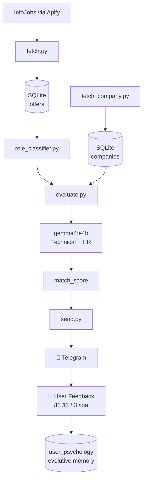

# Job Intelligence Agent

> Personal career intelligence system for the Spanish job market.  
> Scrapes InfoJobs, scores offers against your CV using a local LLM, and delivers ranked recommendations to Telegram — fully offline-first.


---

## What it does

| Step | Module | Description |
|------|--------|-------------|
| **0. Keywords** | `keyword_generator` | Generates search titles from `PERFIL.md` via gemma4:e4b (run once) |
| **1. Fetch** | `fetch.py` | Scrapes InfoJobs via Apify + enriches skills/salary with LLM |
| **2. Score** | `evaluate.py` | Deterministic formula matches each offer to your CV profile |
| **3. Deliver** | `send.py` | Top 3 ranked offers sent to Telegram every morning |


```mermaid
flowchart TD
    A[InfoJobs via Apify] --> B[fetch.py]
    B --> C[(SQLite\noffers)]
    C --> D[role_classifier.py]
    D --> E[evaluate.py]
    E --> F[gemma4:e4b\nTechnical + HR]
    F --> G[match_score]
    G --> H[send.py]
    H --> I[📱 Telegram]
    K[fetch_company.py] --> L[(SQLite\ncompanies)]
    L --> E
    I --> M[💬 User Feedback\n/f1 /f2 /f3 /dia]
    M --> N[(user_psychology\nevolutive memory)]
```

---

## Scoring System

Deterministic 0–1 score. Python computes everything — the LLM contributes only one component (`F_fit`, weight 0.15).

```
S = 0.45·M_core + 0.15·M_sec + 0.25·F_exp + 0.15·F_fit
```

| Weight | Variable | What it measures | Computed by |
|--------|----------|------------------|-------------|
| 0.45 | `M_core` | Average level match over core skills | Python |
| 0.15 | `M_sec` | Average level match over secondary skills | Python |
| 0.25 | `F_exp` | Years of experience, penalised by employment gap | Python |
| 0.15 | `F_fit` | Cultural fit, location, work mode | gemma4:e4b |

Skills use a level multiplier (`L_i = min(cand, req) / req`), experience applies a gap multiplier table, and overqualification is capped at 1.0.

See full details in [`docs/RATING.md`](docs/RATING.md).

---

## Role Classification

Before scoring, each offer is classified by its **actual requirements** — not its job title. Offers receive a canonical role name and a `relevance_flag` (`core` / `adjacent` / `stretch` / `temporal`).

See full design in [`docs/adr/005-classifier-evolucion-v1-a-v6.md`](docs/adr/005-classifier-evolucion-v1-a-v6.md).

---

## Feedback System

After each daily Telegram message, optionally reply with `/f1`, `/f2`, `/f3` (per-offer feedback) or `/dia` (daily emotional context). Feedback is stored and used as psychological context for future evaluations — it never filters offers.

See [`docs/PIPELINE.md#4-send`](docs/PIPELINE.md#4-send).

---

## Intelligence Layer (Phase 4)

The system accumulates data over time to surface strategic signals:

- **Role Discovery** — finds reachable roles with skill overlap, even outside initial search queries
- **Market Signals** — weekly trends: volume, competition, salary, remote %, emerging skills
- **Strategic Advisor** — auto-triggers advice when patterns are detected (cold market, recurring skill gap, low avg score)

---

## Tech Stack

| Layer | Technology |
|-------|------------|
| Language | Python 3.14+ |
| Database | SQLite (WAL mode) |
| ORM | SQLAlchemy 2.0 |
| Local LLM | Ollama (`gemma4:e4b`) |
| Job data source | Apify — InfoJobs Spain Jobs Scraper |
| Notifications | Telegram Bot API |
| Linting | Ruff |
| Scheduling | cron |

## Project Structure

```
src/            → Application code (pipeline, onboarding, telegram, utils)
docs/           → Documentation (ADR, pipeline, setup, database, rating)
tests/          → Unit, integration, and cassette-based tests (171 total)
data/           → SQLite database (gitignored)
scripts/        → Report generators, cron setup, bot scripts
```

See [`docs/PIPELINE.md`](docs/PIPELINE.md) for the full pipeline flow and module details.

---

## Setup

### Prerequisites

- Python 3.14+
- [Ollama](https://ollama.com/) running locally
- Apify account with API token (~$0.09 per pipeline run)
- Telegram bot token (via [@BotFather](https://t.me/botfather))

```bash
ollama pull gemma4:e4b
git clone https://github.com/Veidos/job-intelligence-agent.git
cd job-intelligence-agent
python -m venv .venv && source .venv/bin/activate
pip install -r requirements.txt
cp .env.example .env
# Fill in: APIFY_TOKEN, TELEGRAM_BOT_TOKEN, TELEGRAM_CHAT_ID
python src/db/init_db.py
```

### Onboarding (first run only)

```bash
PYTHONPATH=. python src/onboarding/run.py --cv assets/cv.pdf
# Generates PERFIL.md — review and confirm before continuing
```

### Generate search keywords (once, or when profile changes)

```bash
PYTHONPATH=. python -m src.onboarding.keyword_generator    # Generate from PERFIL.md
PYTHONPATH=. python -m src.onboarding.keyword_generator --manage  # Manual curation
```

### Run the pipeline

```bash
# Full pipeline
PYTHONPATH=. python src/pipeline/run.py

# Individual steps
PYTHONPATH=. python src/pipeline/fetch.py
PYTHONPATH=. python src/pipeline/role_classifier.py
PYTHONPATH=. python src/pipeline/evaluate.py
PYTHONPATH=. python src/telegram/send.py --mode daily

# Keyword management
PYTHONPATH=. python -m src.onboarding.keyword_generator --manage

# Dry run (no Apify, no Telegram)
PYTHONPATH=. python src/pipeline/run.py --dry-run
```

---

## Cost

| Operation | Cost | Frequency |
|-----------|------|-----------|
| Apify actor start | ~$0.09 | Once per day |
| Ollama inference | $0.00 | Local, unlimited |
| Telegram | $0.00 | Free |

**~$2.70/month** at one run per day. Never run the Apify actor manually in development — always use `--dry-run`.

---

## Automation

```cron
# Daily pipeline at 9:00 AM (configurable via Telegram)
0 9 * * * /path/to/.venv/bin/python /path/to/src/pipeline/run.py
```

Send time, number of daily offers, and minimum score are configurable via Telegram commands.

---

## Roadmap

> **Legend:** ✅ complete · 🟡 coded (validation pending via [TESTING.md](docs/TESTING.md)) · ⬜ not implemented

```
Phase 1 — Foundation        ✅ T-0 validated
Phase 2 — Onboarding        ✅ T-1 validated
Phase 3 — Base pipeline     🟡 Coded (validation pending)
Phase 4 — Intelligence      ⬜ Pending
Phase 5 — Automation        🟡 Coded (validation pending)
Phase 6 — Data Analysis     ⬜ Planned
```

See full breakdown in [`docs/TESTING.md`](docs/TESTING.md).

---

## Documentation

| File | Description |
|------|-------------|
| `HANDOFF.md` | Session state — read first if resuming work |
| `PLANS.md` | Project phases and task status (Ledger Method) |
| `MEMORIES.md` | Accumulated system learnings |
| `PERFIL.md` | Candidate profile — source of truth for evaluations |
| `docs/PIPELINE.md` | Complete pipeline flow (fetch → classify → evaluate → send) |
| `docs/SETUP.md` | Installation, commands, cron |
| `docs/DATABASE.md` | Tables, rules, schema |
| `docs/RATING.md` | Detailed scoring system reference |
| `docs/CONVENTIONS.md` | Code style, naming, conventions |
| `docs/adr/` | Architecture Decision Records (10 active) |

> `PERFIL.md` is in `.gitignore`. Never auto-regenerate without explicit user confirmation.

---

## Privacy First

All LLM inference runs **locally via Ollama**. No CV content, personal context, or job evaluation data is sent to any external service except:

- **Apify** — job scraping only, no personal data involved
- **Telegram** — notification delivery only

The `personal_concerns` field (sensitive personal context) is never logged, printed to console, or included in error messages.

---

## Security Notes

- All credentials via environment variables, never hardcoded
- `PERFIL.md` and `data/jobs.db` are excluded from version control
- `personal_concerns` field is never logged or printed to console
