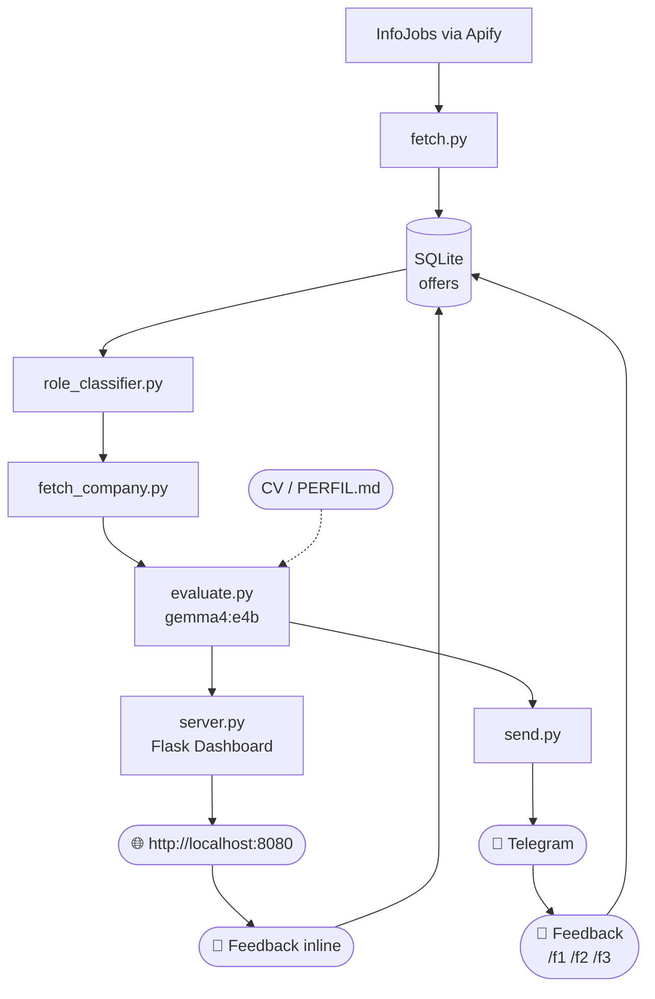

# Job Intelligence Agent

> Personal career intelligence system for the Spanish job market.  
> Scrapes InfoJobs, scores offers against your CV using a local LLM, and delivers ranked recommendations to Telegram — fully offline-first.


---

## What it does

| Step | Module | Description |
|------|--------|-------------|
| **1. Scrape** | `fetch.py` | Persists raw Apify items in `apify_raw_responses` (immutable, append-only) |
| **2. Upsert** | `fetch.py` | Reads raw items, upserts structured fields into `offers` table. No LLM. |
| **3. Enrich** | `fetch.py` | Extracts skills, seniority and salary with gemma4:e4b. Retried automatically if LLM fails. |
| **4. Classify** | `role_classifier.py` | Classifies each offer by real requirements, assigns `relevance_flag` |
| **5. Enrich company** | `fetch_company.py` | Adds company data and reviews to each offer |
| **6. Score** | `evaluate.py` | Deterministic formula matches each offer to your CV profile |
| **7. Dashboard** | `server.py` | Web dashboard at `http://localhost:8080` — view, filter, give feedback, track applications |
| **8. Optional** | `send.py` | Top 3 ranked offers can also be sent to Telegram |


```mermaid
flowchart TD
    A[InfoJobs via Apify] --> B[fetch.py]
    B --> C[(SQLite\noffers)]
    C --> D[role_classifier.py]
    D --> E[fetch_company.py]
    E --> F[evaluate.py\ngemma4:e4b]
    F --> G[server.py\nFlask Dashboard]
    G --> H([🌐 http://localhost:8080])
    H --> I([💬 Feedback inline])
    I --> C
    F --> J[send.py]
    J --> K([📱 Telegram])
    K --> L([💬 Feedback\n/f1 /f2 /f3])
    L --> C
    M([CV / PERFIL.md]) -.-> F
```

---

## Scoring System

Deterministic 0–1 score. Python computes everything — the LLM contributes only one component (`F_fit`, weight 0.15).

```
S = 0.45·M_core + 0.15·M_sec + 0.25·F_exp + 0.15·F_fit
```

| Weight | Variable | What it measures | Computed by |
|--------|----------|------------------|-------------|
| 0.45 | `M_core` | Average level match over core skills | Python |
| 0.15 | `M_sec` | Average level match over secondary skills | Python |
| 0.25 | `F_exp` | Years of experience (capped at 1.0, no gap penalty) | Python |
| 0.15 | `F_fit` | Cultural fit, location, work mode | gemma4:e4b |

Skills use a level multiplier (`L_i = min(cand, req) / req`), experience is `min(cand_years / req, 1.0)`, and overqualification is capped at 1.0. Employment gap is context for the HR LLM, not a numeric penalty.

See full details in [`docs/RATING.md`](docs/RATING.md).

---

## Role Classification

Before scoring, each offer is classified by its **actual requirements** — not its job title. Offers receive a canonical role name and a `relevance_flag` (`core` / `adjacent` / `stretch` / `temporal`).

See full design in [`docs/adr/005-classifier-evolucion-v1-a-v6.md`](docs/adr/005-classifier-evolucion-v1-a-v6.md).

---

## Dashboard (Web UI)

The primary interface is a local web dashboard at `http://localhost:8080`:

```bash
python src/dashboard/server.py
```

**Sections:**
- **🔍 Ofertas** (default) — 10-column sortable table (Score, Título, Empresa, Ubicación, Modalidad, Publicado, Salario, Recomendación, Señal, Bloqueo). Sparkline semanal de actividad en el header. Filters by score, recommendation, relevance, work mode, text. Click any offer for a detail modal with scoring breakdown, skills table, HR verdict, feedback form, collapsible description, InfoJobs link, and application tracker.
- **💼 Aplicaciones** — List with inline `<select>` status. Expandable notes/contact/date panel.
- **🏢 Empresas** — Table + 2 charts (top 5 by offers, sector distribution). Click to filter offers.
- **📊 Monitor** — Narrative flow: KPIs summary → Quality (score, salary, recommendation dist) → Geography (city stacked by work mode) → Skills market (core demand, secondary/soft, actionable gap) → Model accuracy (recommendation×signal matrix) → Activity (weekly volume, score trend, pipeline runs) → Application funnel.

**API REST** (used by the dashboard, also usable directly):
| Endpoint | Method | Description |
|----------|--------|-------------|
| `/api/stats` | GET | Pipeline KPIs |
| `/api/offers` | GET | Offers with evaluations (filterable) |
| `/api/offers/<id>` | GET | Full offer detail + feedback + application |
| `/api/companies` | GET | Companies with stats |
| `/api/feedback` | GET/POST | List or create feedback |
| `/api/applications` | GET/POST | List or create/update applications |
| `/api/applications/<id>` | DELETE | Remove an application |
| `/api/runs` | GET | Pipeline run history |

## Telegram (optional)

After each daily pipeline run, top 3 ranked offers (score >= 35) can be sent to Telegram with `/f1`, `/f2`, `/f3` for per-offer feedback or `/dia` for daily context. Feedback flows into the dashboard.

```bash
python src/telegram/send.py --mode daily
```

See [`docs/PIPELINE.md#4-send`](docs/PIPELINE.md#4-send).

---

## Intelligence Layer (Phase 4)

The system accumulates data over time to surface strategic signals:

- **Role Discovery** — finds reachable roles with skill overlap, even outside initial search queries
- **Market Signals** — weekly trends: volume, competition, salary, remote %, emerging skills
- **Strategic Advisor** — auto-triggers advice when patterns are detected (cold market, recurring skill gap, low avg score)

---

## Tech Stack

| Layer | Technology |
|-------|------------|
| Language | Python 3.14+ |
| Database | SQLite (WAL mode, raw sqlite3) |
| Local LLM | Ollama (`gemma4:e4b`) |
| Job data source | Apify — InfoJobs Spain Jobs Scraper |
| Dashboard | Flask (local web, no ORM) |
| Notifications | Telegram Bot API (optional) |
| Linting | Ruff |
| Scheduling | cron |

## Project Structure

```
src/            → Application code
  pipeline/     → fetch, evaluate, classify, company enrichment
  dashboard/    → Flask web server (server.py + templates + static)
  telegram/     → Bot, send, feedback processor
  onboarding/   → CV extraction, interview, keyword generation
  db/           → Schema, init, migration
  utils/        → Ollama client, helpers
docs/           → ADR, pipeline, setup, database, rating
tests/          → Unit, integration, cassette-based (171 total)
data/           → SQLite database (gitignored)
reports/        → Static HTML dashboards (legacy)
```

See [`docs/PIPELINE.md`](docs/PIPELINE.md) for the full pipeline flow and module details.

---

## Setup

### Prerequisites

- Python 3.14+
- [Ollama](https://ollama.com/) running locally
- Apify account with API token (~$0.09 per pipeline run)
- Telegram bot token (via [@BotFather](https://t.me/botfather))

```bash
ollama pull gemma4:e4b
git clone https://github.com/Veidos/job-intelligence-agent.git
cd job-intelligence-agent
python -m venv .venv && source .venv/bin/activate
pip install -r requirements.txt
pip install flask
cp .env.example .env
# Fill in: APIFY_TOKEN, TELEGRAM_BOT_TOKEN, TELEGRAM_CHAT_ID (Telegram optional)
python src/db/init_db.py
```

### Onboarding (first run only)

```bash
PYTHONPATH=. python src/onboarding/run.py --cv assets/cv.pdf
# Generates PERFIL.md — review and confirm before continuing
```

### Generate search keywords (once, or when profile changes)

```bash
PYTHONPATH=. python -m src.onboarding.keyword_generator    # Generate from PERFIL.md
PYTHONPATH=. python -m src.onboarding.keyword_generator --manage  # Manual curation
```

### Dashboard

```bash
# Start the web dashboard (http://localhost:8080)
PYTHONPATH=. python src/dashboard/server.py

# Custom port
PYTHONPATH=. python src/dashboard/server.py --port 9090
```

### Run the pipeline

```bash
# Full pipeline
PYTHONPATH=. python src/pipeline/run.py

# Individual steps
PYTHONPATH=. python src/pipeline/fetch.py
PYTHONPATH=. python src/pipeline/role_classifier.py
PYTHONPATH=. python src/pipeline/evaluate.py
PYTHONPATH=. python src/telegram/send.py --mode daily  # Optional

# Keyword management
PYTHONPATH=. python -m src.onboarding.keyword_generator --manage

# Dry run (no Apify, no Telegram)
PYTHONPATH=. python src/pipeline/run.py --dry-run
```

---

## Cost

| Operation | Cost | Frequency |
|-----------|------|-----------|
| Apify actor start | ~$0.09 | Once per day |
| Ollama inference | $0.00 | Local, unlimited |
| Telegram | $0.00 | Free |

**~$2.70/month** at one run per day. Never run the Apify actor manually in development — always use `--dry-run`.

---

## Automation

```cron
# Daily pipeline at 9:00 AM (configurable via Telegram)
0 9 * * * /path/to/.venv/bin/python /path/to/src/pipeline/run.py
```

Send time, number of daily offers, and minimum score are configurable via Telegram commands.

---

## Roadmap

> **Legend:** ✅ complete · 🟡 coded (validation pending via [TESTING.md](docs/TESTING.md)) · ⬜ not implemented

```
Phase 1 — Foundation        ✅ T-0 validated
Phase 2 — Onboarding        ✅ T-1 validated
Phase 3 — Base pipeline     ✅ 92 offers evaluated
Phase 4 — Intelligence      ⬜ Pending
Phase 5 — Automation        🟡 Coded (validation pending)
Phase 6 — Dashboard          ✅ Flask web UI with feedback + applications
```

See full breakdown in [`docs/TESTING.md`](docs/TESTING.md).

---

## Documentation

| File | Description |
|------|-------------|
| `HANDOFF.md` | Session state — read first if resuming work |
| `PLANS.md` | Project phases and task status (Ledger Method) |
| `MEMORIES.md` | Accumulated system learnings |
| `PERFIL.md` | Candidate profile — source of truth for evaluations |
| `docs/PIPELINE.md` | Complete pipeline flow (fetch → classify → evaluate → dashboard) |
| `docs/SETUP.md` | Installation, commands, cron, dashboard |
| `docs/DATABASE.md` | Tables, rules, schema |
| `docs/RATING.md` | Detailed scoring system reference |
| `docs/CONVENTIONS.md` | Code style, naming, conventions |
| `docs/adr/` | Architecture Decision Records (13 active) |

> `PERFIL.md` is in `.gitignore`. Never auto-regenerate without explicit user confirmation.

---

## Privacy First

All LLM inference runs **locally via Ollama**. No CV content, personal context, or job evaluation data is sent to any external service except:

- **Apify** — job scraping only, no personal data involved
- **Telegram** — notification delivery only

The `personal_concerns` field (sensitive personal context) is never logged, printed to console, or included in error messages.

---

## Security Notes

- All credentials via environment variables, never hardcoded
- `PERFIL.md` and `data/jobs.db` are excluded from version control
- `personal_concerns` field is never logged or printed to console
