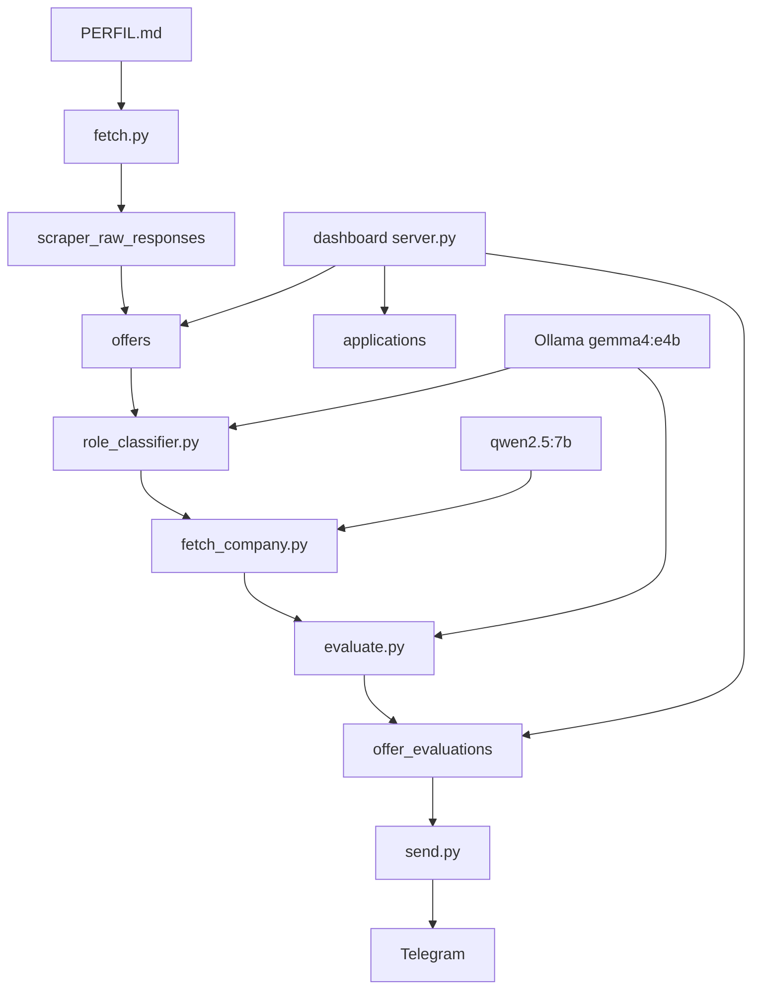

# Job Intelligence Agent

Sistema offline de inteligencia de carrera que extrae ofertas de InfoJobs, las puntúa contra un perfil candidato usando LLMs locales (Ollama), enriquece empresas, y publica un resumen diario en Telegram con dashboard web.

## Badges

- Python ≥ 3.11
- Ollama: gemma4:e4b (técnico + HR) + qwen2.5:7b (empresas)
- SQLite (WAL mode)
- Tests: `pytest tests/ -q` (231 passing) — Ruff: `ruff check src/` (0 errores)
- License: AGPL v3

## Pipeline

| Paso | Módulo | Qué hace |
|------|--------|----------|
| 1&#46; Fetch | `fetch.py` | Scraper propio (`curl_cffi` + BS4). Persist raw → upsert → LLM enrich. Sin Apify. |
| 2&#46; Classify | `role_classifier.py` | Clasifica en roles del catálogo con gemma4:e4b. Asigna `relevance_flag`. |
| 2&#46;5&#46; Enrich | `fetch_company.py` | Enriquece empresas con qwen2.5:7b. Degrada gracefully si falla. |
| 3&#46; Evaluate | `evaluate.py` | Score técnico + HR + bloqueadores duros. Determinista 0–100. |
| 4&#46; Send | `send.py` | Envía top ofertas a Telegram. Opcional. |

## Diagrama


```mermaid
flowchart TD
  A[PERFIL.md] --> B[fetch.py]
  B --> C[scraper_raw_responses]
  C --> D[offers]
  D --> E[role_classifier.py]
  E --> F[fetch_company.py]
  F --> G[evaluate.py]
  G --> H[offer_evaluations]
  H --> I[send.py]
  I --> J[Telegram]
  K[dashboard server.py] --> D
  K --> H
  K --> L[applications]
  M[Ollama gemma4:e4b] --> E
  M --> G
  N[qwen2.5:7b] --> F
```

## Scoring System

```
S = 0.45 · M_core + 0.15 · M_sec + 0.25 · F_exp + 0.15 · F_fit
```

| Componente | Peso | Fuente | Descripción |
|-----------|------|--------|-------------|
| `M_core` | 0.45 | Python | Presencia binaria de skills core del candidato |
| `M_sec` | 0.15 | Python | Presencia binaria de skills secundarias |
| `F_exp` | 0.25 | Python | `years_match = min(candidate_years / experience_min, 1.0)` |
| `F_fit` | 0.15 | gemma4:e4b temp 0.0 | Evaluación cualitativa: cultura, ubicación, gap |

Nota: el score se calcula solo si la oferta no tiene un **bloqueador duro** (`apply_block`). Los bloqueadores los detecta gemma4:e4b en la validación final: titulación obligatoria, carnés específicos, etc. Una oferta bloqueada recibe `match_score = 0`.

| Score | Recomendación |
|-------|---------------|
| ≥ 75 | Prioritario |
| 55–74 | Aplicar |
| 35–54 | Con expectativas bajas |
| < 35 | No aplicar |

## Role Classification

gemma4:e4b clasifica título + descripción → `role_normalized` (del catálogo) + `relevance_flag`. El gap se mide en 5 niveles (estructural > seniority > dominio > herramienta > none) y se mapea a relevance automáticamente.

## Dashboard

Flask en `http://localhost:8080` (host `0.0.0.0`). 4 secciones:

| Sección | Contenido |
|---------|-----------|
| 🔍 Ofertas | Tabla 10 columnas, filtros, modal con breakdown scoring |
| 💼 Aplicaciones | Seguimiento inline con estados |
| 🏢 Empresas | Tabla + charts (top 5, sector) |
| 📊 Monitor | KPIs, calidad, skills, precisión, actividad |

### API REST

| Endpoint | Descripción |
|----------|-------------|
| `/api/stats` | KPIs del pipeline |
| `/api/offers` | Ofertas con filtros |
| `/api/offers/<id>` | Detalle completo |
| `/api/companies` | Empresas con conteos |
| `/api/feedback` | GET/POST feedback |
| `/api/applications` | GET/POST CRUD aplicaciones |
| `/api/applications/<id>` | DELETE |
| `/api/runs` | Historial de ejecuciones |
| `/api/pipeline/run` | POST lanzar pipeline (mutex) |
| `/api/pipeline/stop` | POST detener (SIGTERM) |
| `/api/pipeline/log` | GET log en vivo |
| `/api/pipeline/status` | GET estado actual (+ reconexión) |

## Telegram

- **send.py** — envío diario desde `run.py`, configurable vía `user_settings`.
- **bot.py** — feedback loop con autenticación (`TELEGRAM_USER_ID`). `python -m src.telegram.bot`.

| Comando | Descripción |
|---------|-------------|
| `/start` | Bienvenida |
| `/f1/2/3 <texto>` | Feedback oferta N del día |
| `/dia <texto>` | Estado emocional diario |

## Tech Stack

| Capa | Tecnología |
|------|------------|
| Lenguaje | Python ≥ 3.11 |
| DB | SQLite WAL, sin ORM |
| Scraping | curl_cffi + BeautifulSoup + lxml |
| LLM local | gemma4:e4b (técnico 0.1, HR 0.0) + qwen2.5:7b (empresas 0.0) |
| Dashboard | Flask + Chart.js v4 CDN |
| Telegram | python-telegram-bot v21 |
| PDF | pypdf |
| Utilidades | tenacity, pydantic, python-dotenv, tqdm, colorama |
| Dev | ruff |

## Project Structure

```
├── .env.example
├── PERFIL.md
├── pyproject.toml
├── requirements.txt
├── requirements-dev.txt
├── src/
│   ├── dashboard/
│   │   ├── server.py          # 16 endpoints API REST
│   │   ├── templates/         # dashboard.html (SPA)
│   │   └── static/            # app.js + style.css
│   ├── db/
│   │   ├── schema.sql         # fuente de verdad del schema
│   │   ├── init_db.py
│   │   ├── migrate.py
│   │   └── models.py
│   ├── onboarding/
│   │   ├── run.py
│   │   ├── cv_extractor.py
│   │   └── interviewer.py
│   ├── pipeline/
│   │   ├── run.py             # orquestador
│   │   ├── fetch.py           # scraper propio
│   │   ├── infojobs_scraper.py
│   │   ├── role_classifier.py
│   │   ├── fetch_company.py
│   │   └── evaluate.py
│   ├── telegram/
│   │   ├── send.py
│   │   ├── bot.py
│   │   └── handlers.py
│   └── utils/
│       ├── ollama_client.py
│       ├── candidate_profile.py
│       ├── cleaner.py
│       └── constants.py
└── tests/                     # 231 tests
```

## Setup

### Prerrequisitos

1. Python ≥ 3.11
2. Ollama local con modelos:
   ```bash
   ollama pull gemma4:e4b
   ollama pull qwen2.5:7b
   ```
3. Un bot de Telegram (token de @BotFather)

### Instalación

```bash
# Entorno virtual
python -m venv .venv
source .venv/bin/activate

# Instalar paquete y dependencias
pip install -e .
pip install -r requirements.txt
pip install -r requirements-dev.txt

# Configurar variables de entorno
cp .env.example .env
# Editar .env con tus tokens reales

# Verificar conexión a Ollama
python -c "from src.utils.ollama_client import ollama_call; print(ollama_call('gemma4:e4b', 'Hola', expect_json=False))"
```

### Variables de entorno (.env)

| Variable | Obligatoria | Default | Descripción |
|----------|-------------|---------|-------------|
| `TELEGRAM_BOT_TOKEN` | Sí | — | Token del bot de Telegram (de @BotFather) |
| `TELEGRAM_CHAT_ID` | Sí | — | ID del chat para envío diario |
| `TELEGRAM_USER_ID` | Sí (para bot) | — | Tu user ID de Telegram (autenticación del bot) |
| `DB_PATH` | No | `data/jobs.db` | Ruta a la base de datos SQLite |
| `LOG_PATH` | No | `logs/pipeline.log` | Ruta al log del pipeline |
| `PERFIL_PATH` | No | `PERFIL.md` | Ruta al perfil del candidato |
| `OLLAMA_BASE_URL` | No | `http://localhost:11434` | URL del servidor Ollama |

### Uso

```bash
# Pipeline completo (fetch → classify → enrich → evaluate → send)
python -m src.pipeline.run

# Pipeline sin fetch (solo evaluar pendientes)
python -m src.pipeline.run --skip-fetch

# Pipeline simulado (sin Telegram)
python -m src.pipeline.run --dry-run

# Pipeline con filtro temporal
python -m src.pipeline.run --since-date _7_DAYS

# Solo fetch (scraper propio)
python -m src.pipeline.fetch --max-items 30 --since-date _24_HOURS

# Evaluar ofertas pendientes
python -m src.pipeline.evaluate --limit 10   # 10 ofertas
python -m src.pipeline.evaluate --limit 0    # todas

# Dashboard web
python -m src.dashboard.server              # http://localhost:8080
python -m src.dashboard.server --port 9090  # puerto personalizado

# Bot de Telegram feedback (long polling)
python -m src.telegram.bot

# Lint y formato
ruff check src/
ruff format src/

# Tests
pytest tests/ -q
```

### Integración dashboard ↔ pipeline

El dashboard puede lanzar y detener el pipeline desde la sección Pipeline:

- `POST /api/pipeline/run` — lanza `run.py` como subproceso con `--run-id` (el dashboard pasa el ID de `search_runs` para hacer UPDATE del registro en lugar de INSERT). Usa mutex: si `search_runs.status='running'`, devuelve 409.
- `POST /api/pipeline/stop` — envía SIGTERM al PID almacenado en `search_runs.pid`.
- Reconexión automática: al recargar el dashboard, `GET /api/pipeline/status` detecta un run en ejecución y restaura el polling de log.

## Automation (cron)

```bash
# Pipeline diario a las 9:00
0 9 * * * cd /home/.../job-intelligence-agent && .venv/bin/python -m src.pipeline.run

# Bot de Telegram (systemd recomendado, o screen/tmux para sesión persistente)
.venv/bin/python -m src.telegram.bot
```

## Roadmap

- [x] Fase 1 — Cimientos (DB, Ollama, Telegram, conexiones)
- [x] Fase 2 — Onboarding (extracción CV, entrevista, PERFIL.md)
- [x] Fase 3 — Pipeline base (fetch, classify, evaluate, send)
- [x] Fase 5 — Automatización (bot Telegram, cron, feedback loop)
- [x] Fase 6 — Dashboard web (Flask, Chart.js, 4 secciones, API REST)
- [ ] Fase 4 — Inteligencia (role_discovery, market_signals, strategic_advisor) — pospuesta por prioridad

## Documentation

| File | Purpose |
|------|---------|
| `docs/PIPELINE.md` | Flujo detallado del pipeline paso a paso |
| `docs/DATABASE.md` | Tablas, índices y reglas de datos |
| `docs/RATING.md` | Sistema de puntuación técnico + HR |
| `docs/CONVENTIONS.md` | Estilo de código y fases de implementación |
| `docs/SETUP.md` | Instalación detallada y configuración |
| `docs/TESTING.md` | Checklist de pruebas del pipeline |
| `docs/adr/` | Decisiones técnicas (ADR clásico) |

## Privacy First

- Todo corre localmente. No hay datos enviados a terceros.
- Ollama ejecuta modelos en tu máquina. Sin API keys de OpenAI/Anthropic.
- InfoJobs se scrapea directamente, sin intermediarios.
- La base de datos SQLite es local. Sin sincronización en la nube.
- Los tokens de Telegram solo se usan para enviar/recibir mensajes.

## Security Notes

- `TELEGRAM_BOT_TOKEN` y `TELEGRAM_CHAT_ID` van en `.env` — nunca en código.
- `.env`, `data/jobs.db`, `PERFIL.md` y `logs/` están en `.gitignore`.
- El bot de Telegram requiere `TELEGRAM_USER_ID` para autenticación.
- El dashboard sirve en `0.0.0.0` por defecto — no exponer a Internet sin protección (Tailscale recomendado para acceso remoto).
