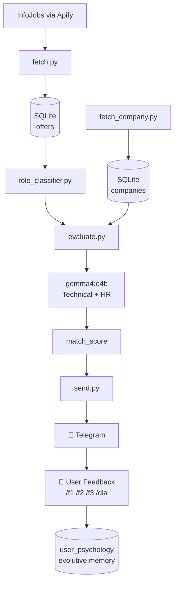

# Job Intelligence Agent


> Personal career intelligence system. Extracts job offers from InfoJobs, evaluates CV match using a local LLM (Ollama + gemma4:e4b), and delivers daily recommendations via Telegram. Built for the Spanish job market. Fully offline-first — no personal data leaves your machine except the Telegram notification.

---

## How It Works

The system runs a daily pipeline: scrapes fresh job offers from InfoJobs via Apify, classifies each offer by actual role (based on requirements, not job title), scores them against your CV using a single local model, and sends the top matches to your Telegram. Over time, it learns from your feedback and builds a psychological profile of your preferences.


```mermaid
flowchart TD
    A[InfoJobs via Apify] --> B[fetch.py]
    B --> C[(SQLite\noffers)]
    C --> D[role_classifier.py]
    D --> E[evaluate.py]
    E --> F[gemma4:e4b\nTechnical + HR]
    F --> G[match_score]
    G --> H[send.py]
    H --> I[📱 Telegram]
    K[fetch_company.py] --> L[(SQLite\ncompanies)]
    L --> E
    I --> M[💬 User Feedback\n/f1 /f2 /f3 /dia]
    M --> N[(user_psychology\nevolutive memory)]
```

| Model | Role | Temperature | Output |
|---|---|---|---|
| `gemma4:e4b` | Technical + HR evaluator (single model) | `0.1` | Structured JSON scores + contextual analysis |

---

## Tech Stack

| Layer | Technology |
|---|---|
| Language | Python 3.14+ |
| Database | SQLite (WAL mode) |
| ORM | SQLAlchemy 2.0 |
| Local LLM | Ollama (`gemma4:e4b`) |
| Job data source | Apify — InfoJobs Spain Jobs Scraper |
| Notifications | Telegram Bot API |
| Linting | Ruff |
| Scheduling | cron |

---

## Project Structure

```
job-intelligence-agent/
├── AGENTS.md              ← AI agent context (read by OpenCode)
├── PERFIL.md              ← Candidate source of truth (gitignored)
├── PLANS.md               ← Project ledger (phases + task status)
├── MEMORIES.md            ← Accumulated system learnings
├── requirements.txt
├── .env                   ← Credentials (never commit)
│
├── assets/
│   └── cv.pdf
│
├── docs/
│   ├── adr/               ← Architecture Decision Records
│   ├── CONVENTIONS.md
│   ├── DATABASE.md
│   ├── PIPELINE.md
│   ├── RATING.md
│   ├── TESTING.md          ← Pipeline integration checklist (🤖/👤)
│   └── SETUP.md
│
├── src/
│   ├── db/
│   │   ├── init_db.py     ← Schema initializer
│   │   ├── schema.sql     ← Single source of truth for DB structure
│   │   └── models.py      ← SQLAlchemy models + helpers
│   │
│   ├── onboarding/
│   │   ├── run.py         ← Orchestrates full onboarding
│   │   ├── cv_extractor.py← gemma4:e4b extracts structured data from CV
│   │   └── interviewer.py ← gemma4:e4b conducts guided interview
│   │
│   ├── pipeline/
│   │   ├── run.py         ← Full pipeline orchestrator + CV freshness check
│   │   ├── fetch.py       ← InfoJobs via Apify → clean → upsert DB
│   │   ├── role_classifier.py ← Classifies offers by real role + relevance
│   │   ├── fetch_company.py   ← Company data and reviews
│   │   └── evaluate.py    ← Single-model scoring (gemma4:e4b)
│   │
│   ├── intelligence/
│   │   ├── role_discovery.py  ← Infers reachable roles from dataset
│   │   ├── market_signals.py  ← Weekly market trend analysis
│   │   └── strategic_advisor.py ← Auto-triggers strategic advice
│   │
│   ├── telegram/
│   │   └── send.py        ← Daily / weekly / alert messages + feedback
│   │
│   └── utils/
│       ├── ollama_client.py ← Ollama wrapper with retries + JSON validation
│       └── cleaner.py     ← Text normalization
│
├── data/
│   └── jobs.db            ← SQLite database (gitignored)
├── logs/
│   └── pipeline.log
├── scripts/
│   ├── reporte_v3.py      ← Classifier HTML report generators (v3–v6)
│   ├── reporte_v4.py
│   ├── reporte_v5.py
│   ├── reporte_v6.py
│   ├── comparativa_classifier.py
│   ├── setup_cron.sh      ← Installs cron job for pipeline
│   ├── start_bot.sh       ← Starts Telegram bot
│   └── stop_bot.sh        ← Stops Telegram bot
└── tests/
    ├── unit/              ← Pure function tests (107)
    ├── integration/       ← DB + pipeline logic (60)
    └── fixtures/
        └── ollama/        ← JSON cassettes for Ollama calls (13)
```

---

## Setup

### Prerequisites

- Python 3.14+
- [Ollama](https://ollama.com/) running locally
- Apify account with API token (~$0.09 per pipeline run)
- Telegram bot token (via [@BotFather](https://t.me/botfather))

```bash
# Pull required model
ollama pull gemma4:e4b
```

### Install

```bash
git clone https://github.com/Veidos/job-intelligence-agent.git
cd job-intelligence-agent
python -m venv .venv && source .venv/bin/activate
pip install -r requirements.txt
```

### Configure

```bash
cp .env.example .env
# Fill in: APIFY_TOKEN, TELEGRAM_BOT_TOKEN, TELEGRAM_CHAT_ID
```

### Initialize database

```bash
python src/db/init_db.py
```

### Onboarding (first run only)

```bash
PYTHONPATH=. python src/onboarding/run.py --cv assets/cv.pdf
# Generates PERFIL.md — review and confirm before continuing
```

### Run the pipeline

```bash
# Full pipeline
PYTHONPATH=. python src/pipeline/run.py

# Individual steps
PYTHONPATH=. python src/pipeline/fetch.py
PYTHONPATH=. python src/pipeline/role_classifier.py
PYTHONPATH=. python src/pipeline/evaluate.py
PYTHONPATH=. python src/telegram/send.py --mode daily

# Dry run (no Apify, no Telegram)
PYTHONPATH=. python src/pipeline/run.py --dry-run
```

---

## Cost

| Operation | Cost | Frequency |
|---|---|---|
| Apify actor start | ~$0.09 | Once per day |
| Ollama inference | $0.00 | Local, unlimited |
| Telegram | $0.00 | Free |

**~$2.70/month** at one run per day. Never run the Apify actor manually in development — always use `--dry-run`.

---

## Scoring System

Match score composed of two independent blocks evaluated by a single model:

### Block A — Technical (gemma4:e4b, 60 pts)

| Criterion | Weight |
|---|---|
| Hard skills overlap | 0–25 |
| Experience match | 0–15 |
| Education level | 0–10 |
| Location / work mode | 0–10 |

### Block B — HR Context (gemma4:e4b, 40 pts base)

| Criterion | Weight |
|---|---|
| Career trajectory coherence | 0–15 |
| Recency of relevant experience | 0–15 |
| Market competitiveness | 0–10 |
| Penalty (from personal context) | 0–(−30) |

### Rating labels

| Score | Label |
|---|---|
| 75–100 | 🟢 Prioritario |
| 55–74 | 🟡 Aplicar |
| 35–54 | 🟠 Con expectativas bajas |
| 0–34 | 🔴 No aplicar |

Daily Telegram sends the **top 3 offers with score ≥ 35**, prioritizing highest scores. If none qualify: `"Sin ofertas relevantes hoy."`.

---

## Role Classification

Before scoring, each offer is classified by its **actual requirements** — not its job title. A "Data Scientist" posting that only requires SQL and Excel is classified as `bi_analyst`. A "Data Analyst" posting requiring PyTorch and MLOps is classified as `ml_engineer`.

The classifier maintains a dynamic catalog of canonical role names (in `snake_case`). New roles are detected deterministically (`role_normalized not in catalog`) and added automatically.

Each offer receives a `relevance_flag` and a `gap_type`:

| Flag | Meaning |
|---|---|
| `core` | Requirements match >70% of candidate profile |
| `adjacent` | 40–70% match, manageable gap (herramienta/dominio) |
| `stretch` | 20–40% match, significant learning required (seniority) |
| `temporal` | Viable bridge job while searching |

### Design principles (ADR-005)

The classifier follows four rules established after 6 iterations (v1–v6):

1. **El modelo razona, Python decide** — `is_new_role`, `gap_type` resolution, JSON validation live in code, not the prompt
2. **Atomic prompt changes** — never bundle a parsing fix with a prompt restructure
3. **Separated decision axes** — FASE 1 (role objective) vs FASE 2 (candidate fit) are never mixed
4. **Trazabilidad siempre** — every computed field is persisted to DB

See [`docs/adr/005-classifier-evolucion-v1-a-v6.md`](docs/adr/005-classifier-evolucion-v1-a-v6.md) for the full evolution and validation tables.

---

## Feedback System

After each daily Telegram message, you can optionally reply:

```
/f1 no me veo en una empresa de marketing
/f2 interesante, pero parece una empresa muy grande
/f3 buena oferta
/dia hoy no tengo energía para aplicar a nada
```

The bot replies `"Anotado 📝"` or `"Entendido, lo tengo en cuenta 🧠"`. Feedback is **never used to filter offers**. Instead, gemma4:e4b uses it to add personalized notes to future evaluations:

> *"Sé que las empresas grandes no son lo tuyo, pero esta oferta encaja técnicamente muy bien con tu perfil."*

A weekly process compresses accumulated feedback into a psychological summary (`user_psychology` table), which evolves over time without growing infinitely.

---

## Intelligence Layer (Phase 4)

The system accumulates data over time to surface strategic signals:

- **Role Discovery** — finds reachable roles with skill overlap, even outside initial search queries
- **Market Signals** — weekly trends: volume, competition, salary, remote %, emerging skills
- **Strategic Advisor** — auto-triggers advice when patterns are detected (cold market, recurring skill gap, low avg score)

---

## Data Analysis (Planned — Phase 6)

As the SQLite dataset grows, a dedicated analysis layer will provide:

- **EDA notebooks** — exploratory analysis of accumulated offers (salary distributions, skill frequency, remote %, location heatmaps)
- **Match score evolution** — personal trend over time
- **Market benchmarking** — compare personal profile gap vs. market demand over weeks
- **Visualizations** — Plotly/Matplotlib dashboards from the live `jobs.db`

> The database schema is designed with this phase in mind — all fields are stored raw alongside normalized versions to support flexible future analysis.

---

## Automation (Phase 5)

```cron
# Daily pipeline at 9:00 AM (configurable via Telegram)
0 9 * * * /path/to/.venv/bin/python /path/to/src/pipeline/run.py
```

Send time and number of daily offers are configurable via Telegram commands (Phase 5).

---

## Roadmap

> **Status legend:** ✅ complete (implemented + validated end-to-end) · 🟡 coded (implemented, validation pending via [TESTING.md](docs/TESTING.md)) · ⬜ not yet implemented

```
Phase 1 — Foundation        ✅ T-0 validated
Phase 2 — Onboarding        ✅ T-1 validated
Phase 3 — Base pipeline     🟡 Coded (validation pending)
  ├── fetch.py              🟡 Coded (T-2 ⏳ ADR-004)
  ├── role_classifier.py    ✅ Validated (v6 estable, ADR-005)
  ├── fetch_company.py      🟡 Coded (T-3 ⏳ ADR-004)
  ├── evaluate.py           🟡 Coded
  ├── send.py               🟡 Coded
  └── run.py (pipeline)     🟡 Coded
Phase 4 — Intelligence      ⬜ Pending
Phase 5 — Automation        🟡 Coded (validation pending)
  ├── cron + schedule       🟡 Coded
  ├── Telegram feedback     🟡 Coded
  └── feedback_processor    🟡 Coded
Phase 6 — Data Analysis/EDA ⬜ Planned
```

---

## Agent Context

This project uses the **Método Ledger** for AI-assisted development:

| File | Purpose |
|---|---|
| `AGENTS.md` | Full context for OpenCode / AI agents — read this first |
| `PLANS.md` | Live project state with task checklist |
| `MEMORIES.md` | Accumulated non-obvious learnings (prompts, field behavior, model quirks) |
| `PERFIL.md` | Candidate profile — source of truth for all evaluations |
| `docs/adr/` | Architecture Decision Records — 5 files: onboarding, CV check, classifier design, testing, etc. |
| `docs/TESTING.md` | Pipeline integration checklist — human/auto distinction |

> `PERFIL.md` is in `.gitignore`. Never auto-regenerate without explicit user confirmation.

---

## Privacy First

All LLM inference runs **locally via Ollama**. No CV content, personal context, or job evaluation data is sent to any external service except:

- **Apify** — job scraping only, no personal data involved
- **Telegram** — notification delivery only

The `personal_concerns` field (sensitive personal context) is never logged, printed to console, or included in error messages.

---

## Security Notes

- All credentials via environment variables, never hardcoded
- `PERFIL.md` and `data/jobs.db` are excluded from version control
- `personal_concerns` field is never logged or printed to console
